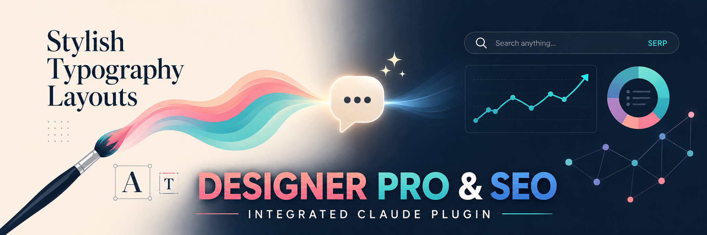

<p align="center">
  
</p>

# Designer Pro and SEO

A Claude Code plugin for the web-design + SEO workflow: research a niche, generate
a coherent design system, write a complete build brief, build, run a pre-delivery
QA gate, port the result into any CMS, and review on-page SEO. One bundle so the
same project context, scripts, and data libraries serve the whole loop.

Free and open source under the **MIT License** — see `LICENSE`.

## Install

This repository is its own Claude Code **plugin marketplace** (it ships a
`.claude-plugin/marketplace.json`), so installing is two commands in Claude Code:

```text
/plugin marketplace add ZachArticulateV/designer-pro-and-seo
/plugin install designer-pro-and-seo@designer-pro-and-seo
```

Run `/plugin` afterward to confirm `designer-pro-and-seo` is enabled — the skills
are then available in every project. See **QUICKSTART.md** for the five-minute
golden path.

**Developing or contributing?** Load a local clone for the current session instead:

```bash
git clone https://github.com/ZachArticulateV/designer-pro-and-seo
claude --plugin-dir designer-pro-and-seo
```

From a clone you can also run the bundled checks from the repo root —
`python3 scripts/smoke_test.py` (use `py` on Windows).

> **Shipping status (v1.0.4 "Deep Core").** **45 of 45 skills are Stable** — **14 Core,
> 28 Lite, 3 routing** (real steps, real scripts/data, graceful degradation without paid
> APIs, smoke-tested). Core skills are 3-layer (earned references + real Agent-tool
> fan-out); Lite skills are Stable single-file, deepened next in v1.1. Every skill
> that can use an external tool is **tool-aware**: it uses a dedicated MCP/CLI when
> present and falls back to Claude's built-in web/browser tools + bundled scripts
> otherwise (`references/CAPABILITY-TIERS.md`). Skill descriptions describe only what
> the shipping version does. Full status: `SHIPPING.md`.

## Why this plugin exists

Web design and SEO aren't the same job — but when you build a website they pull in the
same direction, and most tools treat them as separate. So you end up re-explaining the
same project to a design tool, then an SEO tool, then a QA checklist, then a CMS. They
work hand-in-hand: good SEO depends on decisions design owns (clean semantic structure,
fast and accessible pages, a clear content hierarchy), and good design is wasted if the
page can't be found or crawled. This plugin keeps both in one bundle with shared project
context, scripts, and data, so the whole build loop runs without hand-offs between
disconnected tools:

> **research → design → build → SEO → QA → port** — study the niche and capture the
> brief, generate an on-brand design system and build the pages, optimize them for
> search, run a pre-delivery **QA (quality-assurance)** gate, then port the result into
> any CMS.

("QA" here is *quality assurance*, not Q&A — it sits late on purpose, because it's the
quality check on the **finished** build right before hand-off. The up-front
requirements-gathering you might think of as "questions first" is the **research** step
at the start of the loop.)

## Shipping skills (v1.0.4) — 45 Stable, mostly free-tier

The whole loop runs end to end on the free tier. All 45 skills below are Stable;
**★ marks the 14 Core** skills (deepened this release — earned reference docs and/or a
real parallel agent fan-out). The other 28 are **Lite** (Stable and single-file, slated
for the same depth pass in v1.1), and 3 are **routing** helpers.

**Design (10)**
- ★ `design-system-gen` — generate a full design system: pattern, style, WCAG-safe palette, type pairing, effects.
- `design-dimensions` — structure a design brief around 5 core dimensions (layout, style, color, type, motion).
- `design-motion` — emit real CSS/JS motion (entrances, scroll, micro-interactions) from motion tokens.
- `design-system-persist` — save a design system to disk so later sessions reuse it.
- ★ `design-build` — generate distinctive, production-grade frontend UI from a design system.
- `design-tokens-emit` — export a design system as CSS / Tailwind / SCSS / Style-Dictionary tokens.
- `design-cro` — heuristic conversion review of a landing/funnel page (CTA, above-fold, forms, trust signals).
- ★ `design-accessibility` — audit HTML against WCAG 2.2 (alt text, heading order, labels, contrast, landmarks).
- ★ `design-research` — competitive research on a site + its rivals → a scored intelligence report.
- ★ `design-visual-qa` — screenshot baselines across viewports/browsers, then diff to catch rendering regressions.

**Build & QA (5)**
- `blast-prompt` — write a complete build brief (BLAST format) so an agent can one-shot the build.
- ★ `qa-gate` — 9-phase pre-delivery quality gate → PASS/CONDITIONAL/FAIL with a risk rating + fix list.
- ★ `portable-html-port` — port a built site into one self-contained HTML file for any CMS.
- ★ `parallel-build` — spin up N page variants in parallel from one brief + shared tokens, then compare.
- `html-extract` — capture a reference site's structure, tokens, and components into an inspiration file.

**Content & data (3)**
- `copywriting` — conversion-focused page/section copy (headlines, value props, CTAs, microcopy).
- `content-draft` — draft long-form content (blog / service / landing / guide) from a brief, originality-checked.
- `csv-to-report` — turn a raw CSV into a structured, business-ready report (redacts PII).

**Business / GTM (1)**
- `client-outreach` — cold-outreach openers + follow-up sequences + a compliance-checked import CSV.

**Routing — the three-brain workflow (3)**
- `route-three-brain` — the routing law: when to hand off between Claude, Codex, and Gemini.
- `route-codex-review` — forced adversarial review of Claude's own code/content by Codex before delivery.
- `route-gemini-context` — delegate whole-repo / multi-file analysis to Gemini's large context window.

**SEO (23)**
- ★ `seo-audit` — orchestrates a multi-specialist audit → one weighted health score + prioritized fix list.
- `seo-page` — single-URL SEO review (on-page, meta, schema, images, links) in one pass.
- `seo-technical` — 9-category technical audit (crawl, index, security, mobile, Core Web Vitals, JS render).
- `seo-schema` — detect / validate / generate Schema.org JSON-LD structured data.
- `seo-sitemap` — audit and generate sitemaps.org-compliant XML sitemaps.
- `seo-image-audit` — audit page images (alt, size, WebP/AVIF, srcset, lazy-load, CLS-safe dimensions).
- `seo-content` — content quality + E-E-A-T + AI-citation-readiness analysis.
- `seo-content-brief` — competitive content briefs (headings, word counts, entities, links) from top-rankers.
- ★ `seo-geo` — optimize content to be cited by AI answer engines (AI Overviews, ChatGPT, Perplexity).
- ★ `seo-strategy` — plan multi-month SEO as a six-stage evidence loop, by business type.
- ★ `seo-cluster` — SERP-overlap topic clustering into hub-and-spoke content architecture.
- `seo-sxo` — search-experience optimization: detect page-type / intent mismatches by persona.
- `seo-hreflang` — validate / generate hreflang for international SEO.
- ★ `seo-drift` — git-for-SEO: baseline on-page elements and diff to catch deploy regressions.
- `seo-competitor-pages` — generate "X vs Y" / "alternatives" comparison pages with schema.
- `seo-programmatic` — plan + safeguard SEO for pages generated at scale (templates, thin-content gates).
- `seo-ecommerce` — product/category SEO: Product schema, image SEO, faceted/canonical strategy.
- ★ `seo-local-unified` — local SEO: Google Business Profile, NAP consistency, citations, reviews, LocalBusiness schema.
- `seo-google` — real Google field data (Search Console, PageSpeed/CrUX) when connected.
- `seo-dataforseo` — live SERP / keyword / backlink / AI-visibility data via the DataForSEO MCP.
- `seo-firecrawl` — site crawl / map / JS-render scraping via Firecrawl (free sitemap fallback).
- `seo-backlinks` — backlink profile: referring domains, anchors, toxic flags, competitor gap.
- `seo-image-gen` — generate SEO-ready images (OG, heroes, infographics, favicons) at correct dimensions.

Backed by **32 scripts** — all standard-library-only Python (13 of them are CLI tools).
"Standard-library-only" means they use only what ships with Python, so there is
**nothing to `pip install`**. They include the design engine + palette generator, page
renderer, token emitter, HTML porter, CSV profiler, capability probe, a shared SSRF
guard + guarded page fetcher, and the SEO tools (schema, sitemap, tech-audit, GEO,
hreflang, drift, clustering, local), plus a smoke test and the release verifier. From a
clone, `python3 scripts/smoke_test.py` verifies them. See **QUICKSTART.md**.

## Tool-aware, not paid-gated

Every skill that can use an external tool follows a documented **capability-tier
cascade** (`references/CAPABILITY-TIERS.md`): a dedicated MCP/API if connected →
Claude's built-in web/browser tools + bundled scripts → a CLI connector (e.g. the
Gemini CLI for image generation) → a guided manual path. So the formerly
"in-development" skills (`seo-google`, `seo-dataforseo`, `seo-firecrawl`,
`seo-backlinks`, `seo-image-gen`, `design-research`, `design-visual-qa`) all ship
Stable with a real free/built-in path — they just go *deeper* when you connect a tool.

> Routing helpers invoke the `codex` / `gemini` CLIs directly when present (or the
> adjacent `openai-codex` / `cc-gemini-plugin` tools), and degrade to documented
> manual steps when neither is installed — convenience wrappers, not a hard dependency.

## Architecture

```
designer-pro-and-seo/
├── .claude-plugin/          (plugin.json + marketplace.json)
├── skills/                  (each skill its own SKILL.md)
├── scripts/                 (shared standard-library Python helpers: seo/ design/ workflow/)
├── data/                    (clean-room CSV libraries — see data/README.md)
├── extensions/              (optional MCP wirings, each with setup README + .mcp.json)
├── templates/               (prompt templates and starters)
├── references/              (deep docs loaded on-demand; PROVENANCE ledger; engine contracts)
├── README.md   CLAUDE.md   QUICKSTART.md
├── LICENSE   NOTICE.md   PRIVACY.md   SUPPORT.md   CONTRIBUTING.md
└── RELEASE-NOTES.md
```

## Dependencies

- **Python 3.10+** — for the design reasoning engine and SEO scripts. All shipping
  scripts are **standard library only** — nothing to `pip install`.
- **Optional external tools** — Playwright, Firecrawl, DataForSEO, nanobanana,
  Google APIs. Every skill that can use one also has a **free/reduced path** and
  tells you what the paid path would add. None are required to get value.

## Design principles

- **Written from scratch.** Skill bodies, templates, and data are authored or
  generated for this plugin — inspiration is welcome, copying is not.
- **Skills compose; they don't duplicate.** Shared logic lives in `scripts/`,
  shared data in `data/`, shared prompts in `templates/`, deep docs in `references/`.
- **Degrade gracefully.** A skill without its optional tool reports what it can
  and names what you'd gain by installing it — it never just fails.
- **Truth in advertising.** A skill's description claims only what its shipping
  body actually does.

## Contributing

Issues and pull requests are welcome — this is developed in the open. The short version:
**fork → branch → make your change → run the gates (`smoke_test.py` + `verify_release.py`)
→ open a PR** against `main`. The full step-by-step, the ground rules (authored from
scratch, free path preserved, standard-library-only Python), and the pre-PR checklist are
in **[CONTRIBUTING.md](CONTRIBUTING.md)**. New here? Look for issues labeled
`good first issue`, or open a `skill idea` issue to propose something.

## License & legal

**MIT License** — free to use, modify, and redistribute with attribution; see
`LICENSE`. Third-party attributions: `NOTICE.md`. Data handling: `PRIVACY.md`.
Support (via GitHub issues): `SUPPORT.md`.
